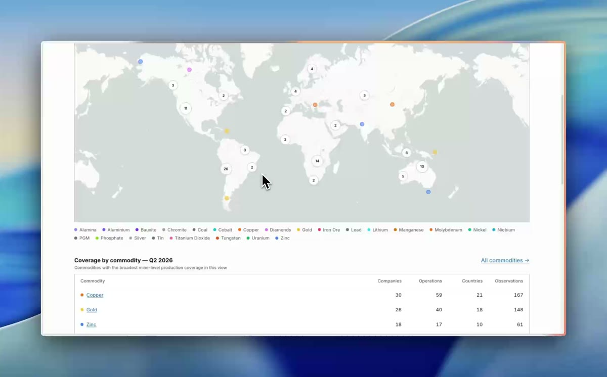
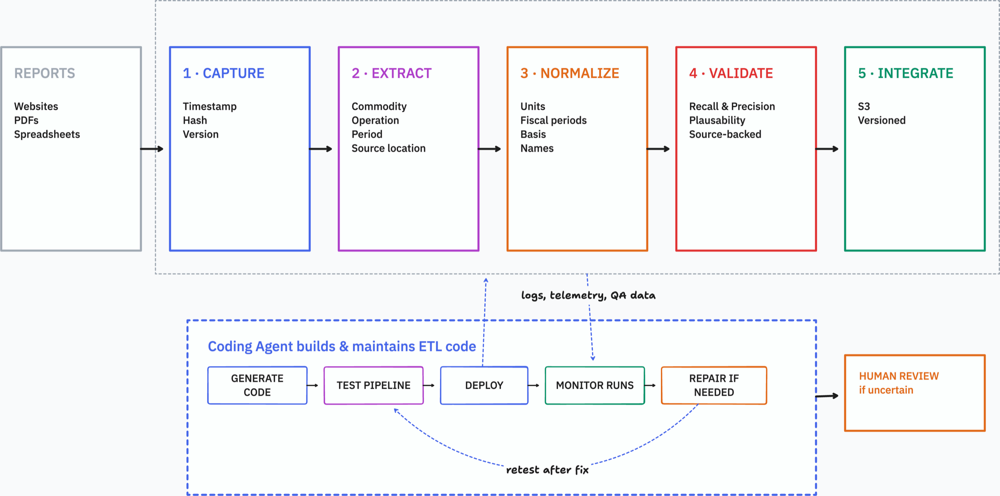

# World Mining Monitor

An open dataset and browser-based explorer for global mine-level production.

**[Open the live app](https://mining.kadoa.com/)** · **[Browse the production data](https://mining.kadoa.com/production)**



## Problem

Production data is public but scattered across company websites, filings, PDFs, and spreadsheets. A useful record must identify the commodity, amount, operation, period, unit, reporting basis, and exact source location.

Normalization is the difficult part, particularly outside standardized filings:

- Units vary: copper may appear in kilotonnes, million pounds, or wet metric tonnes.
- Fiscal calendars use different year-ends and period labels.
- Figures may represent payable metal, contained metal, consolidated production, or an equity-adjusted share.
- “Copper concentrate,” “Cu conc,” and “SX-EW cathode” are related but not interchangeable.
- Ownership and reporting methods are often buried in headings, footnotes, or surrounding text.

Units, product forms, periods, ownership, and reporting bases must remain explicit so that unlike figures are not silently combined.

## Solution and architecture

Instead of manually maintaining bespoke ETL for every company, LLMs help generate and repair deterministic pipeline code. Recurring runs execute that code—not free-form model output—and send unresolved cases for human review.



The pipeline has five stages:

1. **Capture:** Archive new company reports with a timestamp, hash, and version.
2. **Extract:** Use PDF parsers and Gemini 3.7 Flash to identify production facts and their source locations.
3. **Normalize:** Resolve units, periods, bases, and names through direct parsing, deterministic transformations, then an LLM only as a last resort.
4. **Validate:** Check schema, plausibility, recall, precision, and source evidence—guilty until proven innocent.
5. **Integrate:** Publish versioned data for the application and downstream use.

An agent generates, tests, deploys, monitors, and repairs the code. Every repair is retested; uncertain cases go to human review.

## Dataset

Records contain reported and normalized production values, their company, operation, commodity, product form, periods, basis, and source evidence.

The current dataset covers 60+ mining companies and 20+ commodities, including copper, gold, zinc, nickel, iron ore, aluminium, coal, silver, PGMs, and lithium.

| File | Description |
| --- | --- |
| [`public/data/mining.db`](public/data/mining.db) | SQLite database with production records, source evidence, and mine locations |
| [`data/mines-coordinates.json`](data/mines-coordinates.json) | Mine metadata and coordinates |
| [`data/sources.json`](data/sources.json) | Company investor-relations sources monitored for reports |

The app loads SQLite in the browser through [sql.js](https://sql.js.org/), requires no backend, and exports filtered results as CSV.

This repository contains the dataset snapshot, database builder, and web application. The report-extraction and pipeline-management code will follow.

## Run locally

Requires [Bun](https://bun.sh/).

```bash
git clone https://github.com/kadoa-org/world-mining-monitor.git
cd world-mining-monitor
bun install
bun run dev       # http://localhost:5180/mining/
bun run build     # production build
```

## Limitations

Coverage follows company disclosures: mine-level or consolidated, quarterly or half-yearly. Normalization does not make different product forms or reporting bases equivalent; material comparisons should be checked against the source evidence.

## License

The code is available under the [MIT License](LICENSE). Production data is sourced from public company reports and is provided for research and educational use.
