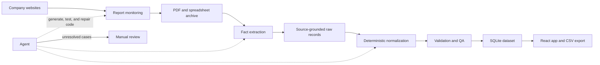

# World Mining Monitor

An open dataset and browser-based explorer for global mine-level production.

**[Open the live app](https://mining.kadoa.com/)** · **[Browse the production data](https://mining.kadoa.com/production)**


## Problem

Global mining production data is public, but it is scattered across inconsistent company websites, filings, PDFs, and spreadsheets. Building a dataset that is correct, auditable, and reliably updated is a substantial data-engineering problem.

For each reported production figure, the dataset needs to establish:

- What was produced, and how much
- Which mine or operation produced it
- Which period the figure covers
- Which unit and reporting basis were used
- Where the figure appears in the source report

Normalization is the difficult part, particularly outside standardized filings such as SEC reports:

- Units vary across reports: copper may be reported in kilotonnes, million pounds, or wet metric tonnes.
- Fiscal calendars do not align: companies use calendar years, June year-ends, September year-ends, and other conventions.
- Reporting bases differ: figures may represent payable metal, contained metal, consolidated production, or an equity-adjusted share.
- Product naming is inconsistent: “copper concentrate,” “Cu conc,” and “SX-EW cathode” are related but not interchangeable.
- Important context is often hidden in headings, footnotes, and surrounding text, including ownership percentages and reporting methods.
- Websites and report layouts change over time.

Converting units alone is not enough. Product form, fiscal period, ownership, and reporting basis must remain explicit so that unlike figures are not silently combined.

## Solution and architecture

The traditional approach is to write and maintain a bespoke ETL pipeline for each company. This project instead uses LLMs to help generate, monitor, and repair deterministic extraction and transformation code. The recurring pipeline runs code—not free-form model output—and escalates unresolved failures for manual review.



### Report discovery

Scraping code monitors company investor-relations websites and captures new quarterly and annual reports.

### Extraction and source evidence

Raw production figures are extracted using a combination of conventional PDF parsing and Gemini 3.7 Flash. Each extracted value retains its source document and, where available, its page, section, table, row, column, and exact excerpt. This evidence supports QA and lets users trace a normalized value back to the original disclosure.

### Deterministic-first normalization

Transformations use the least flexible method that works:

1. Parse the value as reported.
2. Apply deterministic transformation code, such as a unit converter or regex-based mapper.
3. Use an LLM only when a deterministic mapping is not practical.

### Validation and maintenance

Records must pass schema, unit, range, and consistency checks before they enter the published dataset. The working rule is to treat every extracted value as wrong until it passes validation: guilty until proven innocent.

When a website or document layout changes, an agent investigates the failure, updates the relevant extraction or transformation code, and runs its tests. Cases it cannot resolve safely are escalated for manual review.

## Dataset

A production record can include:

- Company, mine, and operation
- Commodity and product form
- Reported value and unit
- Normalized value and unit
- Fiscal and calendar period
- Reporting basis
- Source document and extraction timestamp
- Page, section, table, row, column, and source excerpt

The current dataset covers 60+ mining companies and 20+ commodities, including copper, gold, zinc, nickel, iron ore, aluminium, coal, silver, PGMs, and lithium.

| File | Description |
| --- | --- |
| [`public/data/mining.db`](public/data/mining.db) | SQLite database containing production records, source evidence, and mine locations |
| [`data/mines-coordinates.json`](data/mines-coordinates.json) | Mine metadata, including company, country, region, coordinates, and commodities |
| [`data/sources.json`](data/sources.json) | Company investor-relations sources monitored for reports |

The application loads SQLite directly in the browser through [sql.js](https://sql.js.org/); no backend is required. Filtered results can be downloaded as CSV from the [production table](https://mining.kadoa.com/production).

## Run locally

Requires [Bun](https://bun.sh/).

```bash
git clone https://github.com/kadoa-org/world-mining-monitor.git
cd world-mining-monitor
bun install
bun run dev
```

The application is available at `http://localhost:5180/mining/`.

Create a production build with:

```bash
bun run build
```

## Repository scope

This repository contains the published dataset snapshot, database builder, and web application. The report-extraction and pipeline-management code will follow.

## Limitations

Coverage follows what each company discloses. Some companies publish mine-level figures, while others report only consolidated totals; some report quarterly, while others report half-yearly. Normalization improves comparability but does not make different product forms or reporting bases equivalent. Material comparisons should be checked against the linked source evidence.

## License

The code is available under the [MIT License](LICENSE). Production data is sourced from public company reports and is provided for research and educational use.
